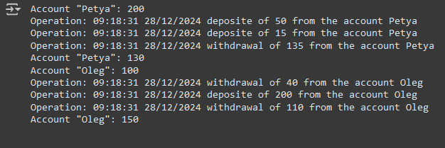

# Задание  
Нужно реализовать класс Account, который отражает абстракцию базового
поведения банковского аккаунта:  
* создать банковский аккаунт с параметрами: имя; стартовый баланс с
которым зарегистрирован аккаунт; история операций*;  
* реализовать два метода, которые позволяют положить деньги на счёт
или снять деньги со счёта;  
* продумать, как можно хранить историю поступления или снятия
денег, чтобы с ней было удобно работать*.  
  
  
# Вывод программы
